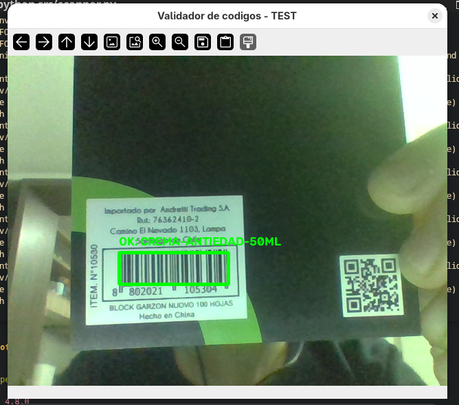
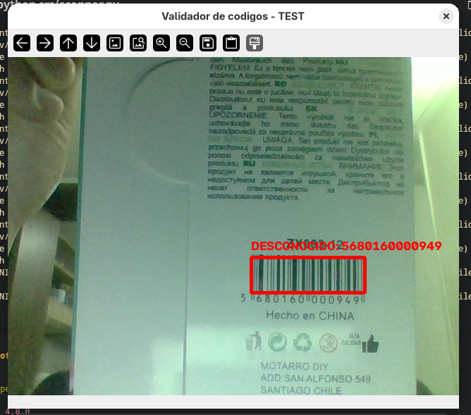

# Barcode Validator

Sistema de validación en tiempo real para procesos de reetiquetado e ingreso de mercancía en centros de distribución. Diseñado para mitigar el error humano en la manipulación de productos de cosmética, perfumería y cuidado personal con SKUs de alta similitud (*look-alike SKUs*).

---

## Módulos y Arquitectura del Proyecto

El sistema utiliza captura de video en vivo para extraer, decodificar y auditar códigos de barras.

```text
[ Cámara / Stream Video ]
│
▼
[ Decodificación de Píxeles (OpenCV + pyzbar) ]
│
▼
[ Verificación en Reglas de Negocio (database.py) ]
│
┌────────┴────────┐
▼                 ▼
[ Match / OK ]   [ Error / Desconocido ]
(Cuadro Verde)   (Cuadro Rojo)
```


---

## Capturas de Pantalla / Demostración

| Escaneo Exitoso (Match) | Código No Autorizado / Error |
| :---: | :---: |
|  |  |

---

## Requisitos del Sistema

### Sistema Operativo
* Linux (probado en Fedora Linux) / macOS / Windows

### Dependencias de Sistema (Fedora Linux)
Es necesario instalar la biblioteca nativa `zbar` para la decodificación de patrones de código de barras:

```bash
sudo dnf install zbar
```

### Entorno de Software

``` bash
Python 3.10 o superior

opencv-python >= 4.8.0

pyzbar >= 0.1.9

numpy >= 1.24.0
```

### Instalación y Configuración
Clonar el repositorio:

```bash
git clone [https://github.com/dianAnton/project_barcode_validator.git](https://github.com/dianAnton/project_barcode_validator.git)
cd barcode-validator
```

Crear y activar el entorno virtual:

``` bash
python3 -m venv venv
source venv/bin/activate
```

Instalar dependencias de Python:

``` bash
pip install --upgrade pip
pip install -r requirements.txt
```

Estructura del Proyecto

```Plaintext
barcode-validator/
├── README.md
├── requirements.txt
├── .gitignore
├── docs/
│   └── screenshots/
└── src/
    ├── database.py       # Definición de reglas de negocio y mapeo de SKUs
    └── scanner.py        # Captura de video, procesamiento de frames y renderizado
```

Uso
Para iniciar el sistema de escaneo con la cámara predeterminada (/dev/video0):

``` bash
python src/scanner.py
Presione la tecla q dentro de la ventana de video para finalizar la ejecución.
```


